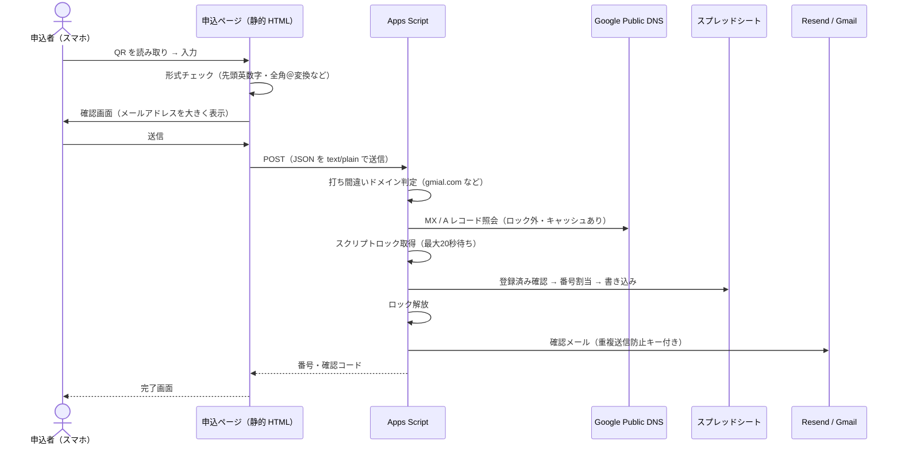
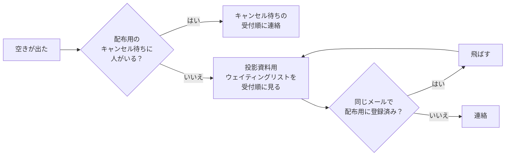

# 10/4 QR コード申込システム 全体まとめ

2026年10月4日（日）日本レセプト学会 学術研究会（昭和女子大学）で使う、QR コードから開く申込ページ4種の全体像。設定の流れ、コーディングの特徴、運用上の注意を1か所にまとめる。

詳細な仕様・手順はそれぞれの手順書を正とする。

| 手順書 | 対象 |
|---|---|
| [`entry-ticket.md`](entry-ticket.md) | 会場配布資料用（整理券＋キャンセル待ち） |
| [`entry-waitlist.md`](entry-waitlist.md) | 投影資料用（ウェイティングリスト） |
| [`entry-ticket-test-report.md`](entry-ticket-test-report.md)・[`kanrishi-test-report.md`](kanrishi-test-report.md)・[`entry-waitlist-test-report.md`](entry-waitlist-test-report.md) | 本番テストの記録 |

---

## 1. 入口は4つ

| | 会場配布資料用（整理券） | 投影資料用（ウェイティングリスト） |
|---|---|---|
| 病院向けAI研修 | `https://www.iha-as.com/entry/` | `https://www.iha-as.com/entry-live/` |
| 医療AIガバナンス管理士 | `https://www.iha-as.com/kanrishi/` | `https://www.iha-as.com/kanrishi-live/` |
| 受付内容 | 整理券50枠（`001`〜／`K-001`〜）→ 定員後はキャンセル待ち | ウェイティングリストのみ（上限なし） |
| 完了画面 | 整理番号＋確認コード | 「投影資料用ウェイティングリスト N番目」＋確認コード |
| Apps Script | プロジェクト `entry-ticket`（`entry-ticket.gs`） | プロジェクト `entry-waitlist`（`entry-waitlist.gs`） |
| 記録タブ | `1004_整理券`・`1004_キャンセル待ち`・`1004_管理士_整理券`・`1004_管理士_キャンセル待ち` | `1004_投影_病院向け_ウェイティング`・`1004_投影_管理士_ウェイティング` |
| QR コード | `docs/entry-qr/entry-qr.*`・`kanrishi-qr.*` | `docs/entry-qr/entry-live-qr.*`・`kanrishi-live-qr.*` |

- スプレッドシートのファイルは1つ（`190L3DfU…`）で、タブを6つに分けている
- **会場配布資料の QR からの申込者が優先**。投影用のページとメールにその旨を明記し、優先はシステムではなく連絡順で守る（[4章](#4-当日運用の要点)）
- 4ページとも `noindex,nofollow` で、サイト内のどこからもリンクしない（QR からだけ開く）

---

## 2. 概念図

### 2.1 全体構成

```mermaid
flowchart TB
  subgraph 会場
    QR1[配布資料 QR<br>病院向け]
    QR2[配布資料 QR<br>管理士]
    QR3[投影スライド QR<br>病院向け]
    QR4[投影スライド QR<br>管理士]
  end

  subgraph GitHub Pages["GitHub Pages（www.iha-as.com）"]
    P1["/entry/"]
    P2["/kanrishi/"]
    P3["/entry-live/"]
    P4["/kanrishi-live/"]
  end

  subgraph GAS["Google Apps Script（Web アプリ）"]
    T["entry-ticket<br>整理券＋キャンセル待ち"]
    W["entry-waitlist<br>ウェイティングリスト"]
  end

  subgraph Sheet["スプレッドシート（1ファイル）"]
    S1[(1004_整理券<br>1004_キャンセル待ち)]
    S2[(1004_管理士_整理券<br>1004_管理士_キャンセル待ち)]
    S3[(1004_投影_病院向け_ウェイティング)]
    S4[(1004_投影_管理士_ウェイティング)]
  end

  QR1 --> P1
  QR2 --> P2
  QR3 --> P3
  QR4 --> P4
  P1 -- "POST program=hospital" --> T
  P2 -- "POST program=kanrishi" --> T
  P3 -- "POST program=hospital" --> W
  P4 -- "POST program=kanrishi" --> W
  T --> S1
  T --> S2
  W --> S3
  W --> S4
  W -. "確認コード重複チェック<br>（読み取りのみ）" .-> S1
  W -. .-> S2
  T --> M["確認メール<br>Resend → 失敗時 Gmail"]
  W --> M
```

### 2.2 1件の申込の流れ



### 2.3 空きが出たときの連絡順（制度ごと）



---

## 3. 設定の流れ（ゼロから作る場合）

実際に行った順番。各手順の詳細は手順書を参照。

| # | 作業 | 担当 | 詳細 |
|---|---|---|---|
| 1 | 申込ページを配置し main に push（GitHub Pages に即時反映） | 開発 | `entry/`・`kanrishi/`・`entry-live/`・`kanrishi-live/` |
| 2 | Apps Script プロジェクト `entry-ticket` を作成し、`entry-ticket.gs` とマニフェストを貼る | 協会 | [entry-ticket.md「B」](entry-ticket.md) |
| 3 | `setupTickets` を1回実行（整理券4タブと番号・確認コードを作成） | 協会 | 既存タブは変更しない |
| 4 | ウェブアプリとしてデプロイし、URL をページの `TICKET_API_URL` に設定 | 協会→開発 | |
| 5 | **別の**プロジェクト `entry-waitlist` を作成し、`entry-waitlist.gs` とマニフェストを貼る | 協会 | [entry-waitlist.md「A」](entry-waitlist.md) |
| 6 | `setupWaitlist` を1回実行（投影用2タブを作成） | 協会 | |
| 7 | 新しいデプロイを作成し、URL をページの `WAITLIST_API_URL` に設定 | 協会→開発 | |
| 8 | （任意）Resend の API キーなどをスクリプトプロパティに設定し、`installDeliveryTrigger` を実行 | 協会 | 両プロジェクトで別々に設定する |
| 9 | QR コードを生成 | 開発 | `cd scripts/qr && npm install && node make-qr.js` |
| 10 | 本番テスト → テストデータ消去 → 件数0を確認 | 両方 | [5章](#5-テスト) |

### 3.1 マニフェスト（`appsscript.json`）

Apps Script の権限・タイムゾーン・公開範囲を決める設定ファイル。エディタでは初期状態で非表示なので、「プロジェクトの設定」→「"appsscript.json" マニフェスト ファイルをエディタで表示する」をオンにしてから、`google-apps-script/appsscript.json` の内容で置き換える。

| 設定 | 値 | 理由 |
|---|---|---|
| `timeZone` | `Asia/Tokyo` | 受付日時を日本時間で記録 |
| `webapp.executeAs` | `USER_DEPLOYING` | デプロイした協会アカウントの権限でシートに書く |
| `webapp.access` | `ANYONE_ANONYMOUS` | ログインなしで申込できる |
| `oauthScopes` | spreadsheets・send_mail・external_request・scriptapp | シート、Gmail 送信、DNS／Resend 通信、到達確認トリガー |

### 3.2 デプロイの2種類（取り違え注意）

| 操作 | URL | 使う場面 |
|---|---|---|
| 「デプロイを管理」→ 鉛筆 → バージョン「新バージョン」 | **変わらない** | コードを直したとき（通常はこちら） |
| 「新しいデプロイ」 | **新しく発行される** | 最初の1回だけ |

---

## 4. 当日運用の要点

- 受付照合：画面またはメールの **番号（受付順）＋確認コード＋氏名** をシートで確認。確認コードは6タブすべてで重複しないので、Ctrl+F で1件に絞れる
- 番号の見分け方：数字のみ＝病院向けの整理券、`K-` 付き＝管理士の整理券、「N番目」＝キャンセル待ちまたは投影用
- 件数確認：各 Web アプリ URL をブラウザで開く（`programs` に制度ごとの件数）
- 受付停止：スクリプトプロパティ `ACCEPTING_HOSPITAL`／`ACCEPTING_KANRISHI`／`ACCEPTING` を `false`（即時反映、プロジェクトごと）
- 受付中は「状態」〜「メールID」列を手で書き換えない
- **タブ名は変えない**。Apps Script がタブを名前で探しているため、変えると受付が止まる（変える場合は gs の定数を直して再デプロイ）

---

## 5. テスト

| 種類 | コマンド | 内容 |
|---|---|---|
| Apps Script のモックテスト | `node scripts/gas-mock/entry-ticket.test.js`<br>`node scripts/gas-mock/entry-waitlist.test.js` | Node 上で gs を読み込み、シート・メール・DNS をモックして割当・重複・打ち間違い・受付停止・件数などを確認。本番のシートには触れない |
| 本番の画面テスト（送信なし） | `node scripts/entry-prod-shots.js`<br>`node scripts/kanrishi-prod-shots.js`<br>`node scripts/live-prod-shots.js` | Playwright で本番ページを操作・撮影（`docs/entry-screenshots/`） |
| 本番の送信テスト | 上記に `SUBMIT_EMAIL`・`HOSPITAL_EMAIL`・`KANRISHI_EMAIL` などを付けて実行 | 実際に1件ずつ登録される。**終わったらテストデータを消去** |

本番テストの後片付け：

1. 整理券タブ（2つ）：テスト行の C〜J 列だけ消す（A・B 列の番号と確認コードは残す）
2. キャンセル待ちタブ・投影用タブ：2行目以降を行ごと削除
3. 両方の Web アプリ URL で `used:0`／`waiting:0`／`registered:0` を確認

Playwright はサンドボックス外のブラウザを使うため `PLAYWRIGHT_BROWSERS_PATH=$HOME/Library/Caches/ms-playwright` を付けて実行する。

---

## 6. コーディングの特徴

### 6.1 申込ページ（静的 HTML）

- **ビルドなしの1ファイル構成**：HTML・CSS・JavaScript を `index.html` 1枚に収め、GitHub Pages にそのまま置く。4ページは同じ骨格で、違いは見出し・送信先 URL・`program` の値だけ
- **3段階の画面**：入力 → 確認（メールアドレスを大きく表示）→ 完了。確認画面で本人に誤入力を気づかせる
- **CORS プリフライト回避**：JSON を `Content-Type: text/plain` で送る。Apps Script の Web アプリは OPTIONS に応答できないため
- **タイムアウト**：`AbortController` で30秒。サーバー側のロック待ち（最大20秒）＋処理時間を見込んだ値
- **再送信に強い**：通信エラーで番号が表示されなくても、同じメールで送り直せば同じ番号が返る（画面にもそう案内する）
- **見出しの改行制御**：`<span class="nb">`（`display:inline-block`）で語の途中での改行を防ぐ。スマホ幅でも「投影資料用／ウェイティングリスト」のように意味の区切りで折り返す
- **打ち間違いのフォーカス**：サーバーがメールの誤りを返したら、入力画面に戻してメール欄にフォーカス

### 6.2 Apps Script

- **制度を設定で切り替える**：`PROGRAMS` オブジェクトにタブ名・定員・番号の頭文字・表示名をまとめ、処理本体は共通。制度を増やすときは設定を1件足す
- **排他制御**：`LockService` のスクリプトロック内で「登録済み確認 → 空き番号検索 → 書き込み」を一括実行。同時申込でも到着順に1件ずつ処理され、二重発行や定員超過が起きない
- **ロックの外で外部通信**：DNS 照会・メール送信はロック外で行い、ロック保持時間を短くする
- **冪等性（何度送っても結果が同じ）**：同じメールアドレスなら既存の番号を返し、確認メールは再送しない。画面には「登録済み」を表示
- **確認コード**：英数字4文字。読み間違えやすい文字（0/O・1/I/L・2/Z・5/S・6/G・8/B）を除いた `ACDEFHJKMNPQRTUVWXY3479` から生成。整理券の番号とコードは `setupTickets` で事前に作っておく
- **プロジェクトをまたいだ重複防止**：`entry-waitlist` は配布用4タブを**読み取りだけ**して、既存の確認コードと重ならないコードを作る（`DISTRIBUTION_SHEETS`）
- **メールアドレスの検証（3段）**
  1. 形式：先頭が英数字でないもの（`=`・`+`・`-` 始まり）は拒否（シートで数式として実行されるのを防ぐ）。全角「＠」は半角に変換
  2. 打ち間違いドメイン：`gmial.com` のように**実在するため DNS を通ってしまう**誤記を `TYPO_DOMAINS` で検出し、「@gmail.com の誤りでは？」と返す
  3. 実在チェック：Google Public DNS で MX（なければ A）レコードを照会。結果はキャッシュ。照会自体が失敗したときは申込を止めない
- **メール送信の二段構え**：Resend（到達確認つき）で送り、未設定・失敗時は Gmail（`MailApp`）で代わりに送る。Resend の重複送信防止キーには制度・番号・**発行日時**・メールを含めるので、テストデータを消して同じ番号で再テストしてもメールが届く
- **到達確認**：5分ごとの時間トリガー（`checkDelivery`）が Resend から配信結果を取得し、「到達状況」列を更新
- **準備前の安全策**：タブがない（setup 未実行）ときは書き込まず「受付準備中です」を返す
- **最新値の読み取り**：シートは `getDisplayValues()` で読み、表示どおりの文字列で比較する
- **状態確認 API**：Web アプリ URL を GET すると `service`（どちらのプロジェクトか）と制度ごとの件数を JSON で返す。デプロイ確認・件数確認・テスト後の片付け確認に使う

### 6.3 QR コード（`scripts/qr/make-qr.js`）

| 項目 | 値 | 理由 |
|---|---|---|
| 誤り訂正レベル | H（約30%欠けても読める） | 印刷のかすれ・投影時の歪みに強くする |
| サイズ | PNG 1200×1200px、SVG（拡大しても劣化しない） | 印刷は PNG、スライドは SVG |
| 色 | `#0B3B66`（サイトの紺）／白背景 | ブランド色でも読み取りに十分なコントラスト |
| 検証 | 生成後に `jsqr` でデコードし、URL と一致するか確認（`MATCH`） | 取り違え・生成ミスの防止 |

4種は見た目で区別できないため、配布資料・スライドでは **QR のすぐ近くに制度名と「会場配布資料用」「投影資料用」を書く**。

---

## 7. つまずいた点と対策

| 事象 | 原因 | 対策 |
|---|---|---|
| 配布用ページが投影用のコードで動いてしまった | `entry-waitlist.gs` を `entry-ticket` プロジェクトに貼って新バージョンをデプロイした | 「デプロイを管理」で前のバージョンに戻して復旧。gs を貼る前に1行目のコメントでプロジェクトを確認する。gs は必要な行だけ書き換える |
| 申込が「受付準備中」になる | `setupTickets`／`setupWaitlist` を実行していない | 実行してタブを作る |
| `gmial.com` が DNS チェックを通る | このドメインは実在する | 打ち間違いドメイン一覧（`TYPO_DOMAINS`）で先に判定 |
| Resend の重複送信防止キーでエラー | ヘッダーに日本語（タブ名）が入っていた | 英数字の制度キー・番号・日時だけでキーを作る |
| テスト後に件数が0に戻らない | 別のタブを消していた／行が残っていた | Web アプリ URL の件数で必ず確認する |
| 表記の混同（会場参加用） | 「会場参加」には配布用の整理券も含まれる | 「会場配布資料用 整理券」「投影資料用ウェイティングリスト」に統一 |

---

## 8. ファイル一覧

| ファイル | 役割 |
|---|---|
| `entry/index.html`・`kanrishi/index.html` | 会場配布資料用 整理券ページ |
| `entry-live/index.html`・`kanrishi-live/index.html` | 投影資料用ウェイティングリストページ |
| `google-apps-script/entry-ticket.gs` | 整理券＋キャンセル待ち（プロジェクト `entry-ticket`） |
| `google-apps-script/entry-waitlist.gs` | 投影資料用ウェイティングリスト（プロジェクト `entry-waitlist`） |
| `google-apps-script/appsscript.json` | 両プロジェクト共通のマニフェスト |
| `docs/entry-qr/` | QR コード4種（PNG・SVG） |
| `docs/entry-screenshots/` | 本番テストのスクリーンショット |
| `scripts/qr/make-qr.js` | QR コード生成と読み取り検証 |
| `scripts/gas-mock/*.test.js` | Apps Script のモックテスト |
| `scripts/entry-prod-shots.js`・`kanrishi-prod-shots.js`・`live-prod-shots.js`・`entry-wait-shot.js` | 本番ページの Playwright テスト・撮影 |
