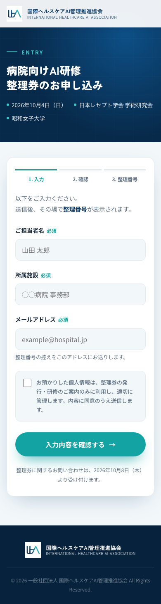
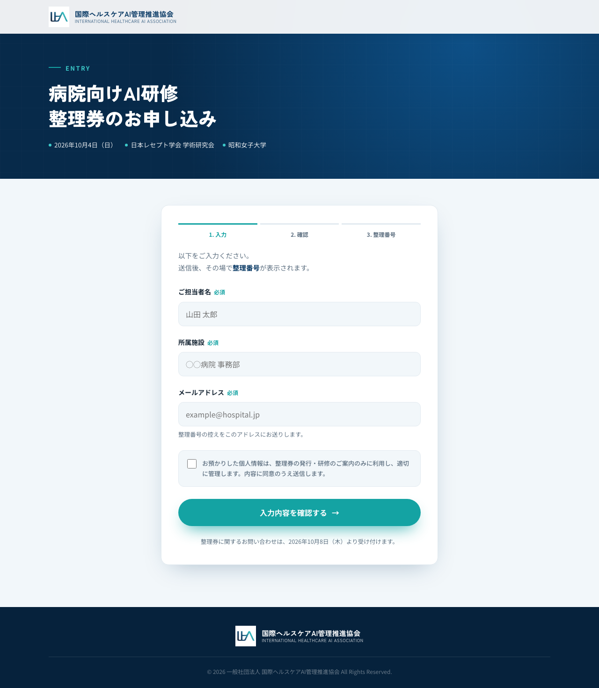
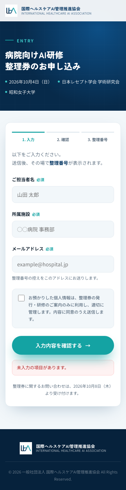
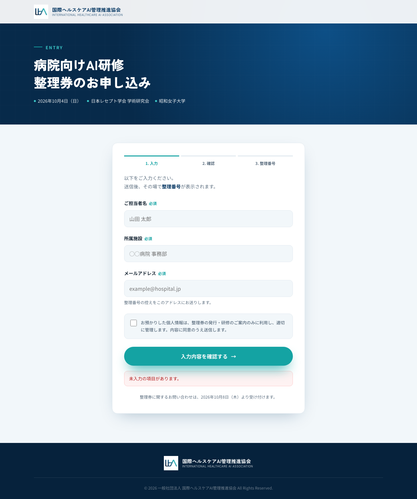
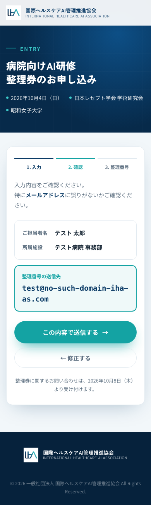
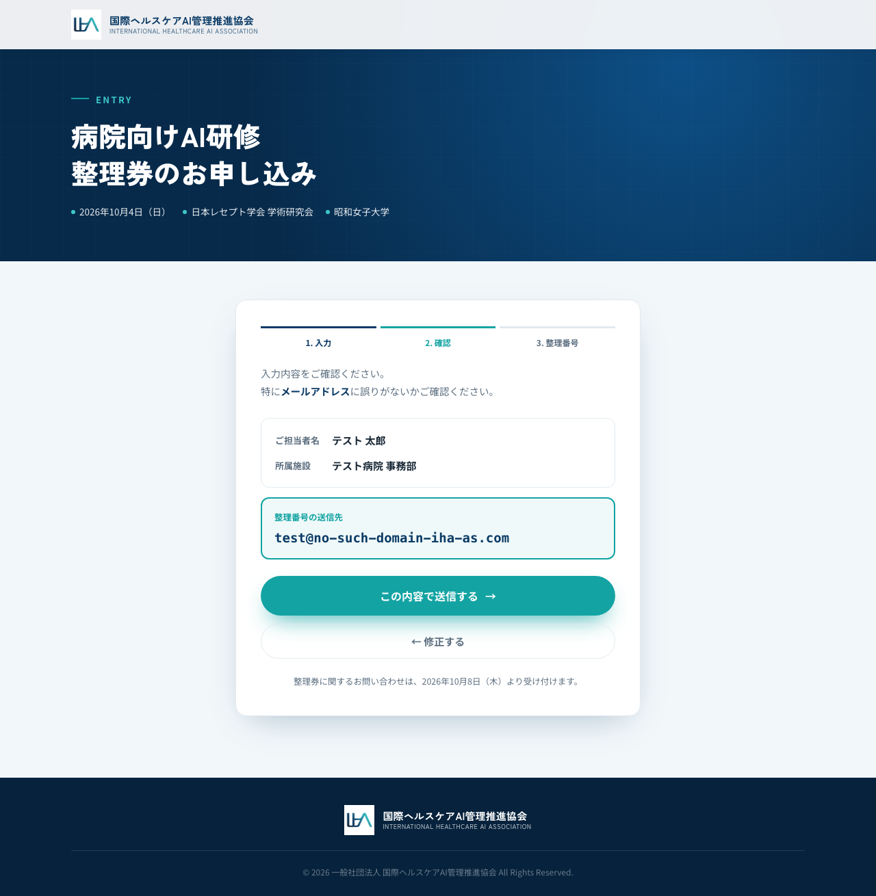
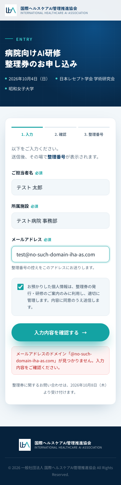
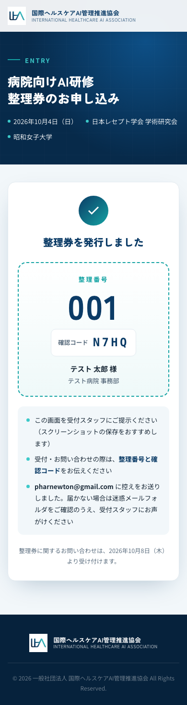
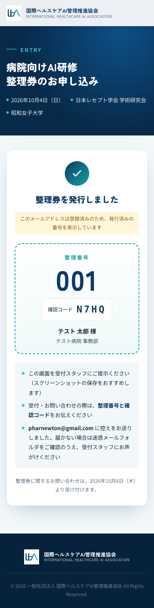
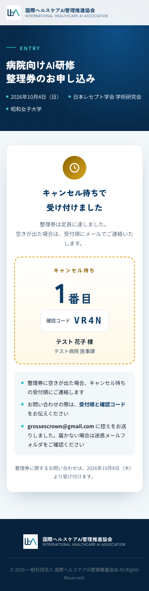

# 10/4 整理券発行システム 動作確認レポート

- 実施日：2026-09-30
- 対象：本番 `https://www.iha-as.com/entry/`（main `3e6728f`）＋ Apps Script Web アプリ `entry-ticket`
- 方法：Playwright（Chromium）で本番ページを操作・撮影。シート・メールは目視確認
- 条件：Resend 未設定（`"resend":false`）→ 確認メールは Gmail（MailApp）で送信
- 仕様・手順：[`entry-ticket.md`](entry-ticket.md)

## 結果サマリー

| # | 受入基準 | 結果 | 備考 |
|---|---|---|---|
| 1 | ロゴ・ヘッダー・フッターが `contact.html` と同じ見た目 | OK | |
| 2 | スマホ幅（390px）で横スクロールが出ない | OK | 1280px でも出ない |
| 3 | 未入力・形式不正・同意なしでエラー、確認画面に進まない | OK | 形式不正時はメール欄にフォーカス |
| 4 | 確認画面でメールを大きく表示、「修正する」で入力内容を保持 | OK | 全角「＠」は半角に変換 |
| 5 | 送信 → 整理番号＋確認コード表示、シート記録、確認メール受信 | OK | 001 / N7HQ |
| 6 | 5〜10分後に到達状況が「到達」 | 対象外 | Resend 未設定のため「確認不可（Gmail送信）」 |
| 7 | 同じメールで再送信 → 同じ番号・コード＋「登録済み」、メール再送なし | OK | |
| 8 | 存在しないドメイン → エラーで入力画面に戻り、メール欄にフォーカス | OK | 下記「気づいた点」参照 |
| 9 | 定員到達時 → キャンセル待ち N番目＋確認コード、キャンセル待ちタブに記録 | OK | 1番目 / VR4N |
| 10 | テストデータ消去 | OK | `used:0` / `waiting:0` を確認 |

## テスト手順と結果

### 1. 送信しない範囲（シートへの書き込みなし）

`node scripts/entry-prod-shots.js`

| 画面 | スマホ（390px） | PC（1280px） |
|---|---|---|
| 入力 |  |  |
| 未入力エラー |  |  |
| 確認 |  |  |

存在しないドメイン（`test@no-such-domain-iha-as.com`）で送信 → 「ドメイン…が見つかりません」で入力画面に戻る。ドメイン確認はシート処理の前に行うため、書き込みは発生しない。

### 2. 整理券の発行（1件送信）

事前に `setupTickets` を実行（`total:50`）。`SUBMIT_EMAIL=pharnewton@gmail.com node scripts/entry-prod-shots.js`

| 新規発行（001 / N7HQ） | 同じメールで再送信 |
|---|---|
|  |  |

- シート `1004_整理券` の 001 行に記録（状態「発行済」、メール送信「送信済」、到達状況「確認不可（Gmail送信）」）
- 件名「【整理番号 001】…」のメールを受信、本文に確認コード
- 再送信ではメールは送られない

### 3. キャンセル待ち

`1004_整理券` の 002〜050 の「状態」に一時的に「発行済」を入力（`used:50`）。`SUBMIT_EMAIL=grossescrown@gmail.com node scripts/entry-wait-shot.js`

| 新規（1番目 / VR4N） | 同じメールで再送信 |
|---|---|
|  |  |

- シート `1004_キャンセル待ち` の2行目に記録（1 / VR4N / 待機中）
- 件名「【キャンセル待ち 1番目】…」のメールを1通受信

### 4. 後片付け

手順書 F-7 に沿って消去。Web アプリ URL の応答で `{"total":50,"used":0,"waiting":0,"accepting":true}` を確認。

## 途中で見つかった問題

| 事象 | 原因 | 対応 |
|---|---|---|
| 送信すると「通信エラー」表示 | `setupTickets` 未実行でタブが無く、Apps Script が `TypeError: Cannot read properties of null (reading 'getLastRow')` | `setupTickets` を実行して解消 |

## 気づいた点（未対応）

- **`test@gmial.com` はドメインエラーにならない**：`gmial.com` は実在する（A レコードあり）ため、実在チェックを通過する。手順書 F-5 のテスト例としては使えないので、存在しないドメインで確認した。よくある打ち間違いドメインを弾くには、別途リストでの判定が必要
- **同じメールでのテストは24時間あけるか別アドレスで**：Resend 利用時は「番号＋メール」で重複送信防止をしているため、データ消去後に同じアドレス・同じ番号で送ると、24時間以内はメールが送られない
- メール欄は数式インジェクション対策（`clean_`）の対象外。`=` 等で始まるアドレスはシートで数式として扱われる

## 当日までの残作業

- QR コード作成・印刷（`https://www.iha-as.com/entry/`）
- 受付スタッフへ照合方法（整理番号＋確認コード＋氏名）を共有
- 10/4 開場前に1件テスト → データ消去 → 受付開始
- 終了後：`ACCEPTING` = `false`
