# 投影資料用ウェイティングリスト 動作確認レポート（＋表記変更後の全体確認）

- 実施日：2026-09-30
- 対象：本番 `https://www.iha-as.com/entry-live/`・`/kanrishi-live/`（投影用）、`/entry/`・`/kanrishi/`（配布用）（main `09a23eb`）
- Apps Script：投影用 `entry-waitlist`（URL `AKfycbzUDeWK…`）、配布用 `entry-ticket`（URL `AKfycbwoKO0…`、変更なし）
- 方法：Playwright（Chromium）で本番ページを操作・撮影（`scripts/live-prod-shots.js`・`scripts/kanrishi-prod-shots.js`・`scripts/entry-prod-shots.js`）。シート・メールは目視確認
- 条件：Resend 未設定（`"resend":false`）→ 確認メールは Gmail（MailApp）で送信
- 仕様・手順：[`entry-waitlist.md`](entry-waitlist.md)／配布用：[`entry-ticket.md`](entry-ticket.md)

## 表記の変更

配布用と投影用を区別しやすくするため、テスト途中で表記を変更した（`09a23eb`、Apps Script は両方とも「デプロイを管理 → 新バージョン」で URL 据え置き）。

| | 変更前 | 変更後 |
|---|---|---|
| 配布用の見出し | 病院向けAI研修／整理券のお申し込み | 病院向けAI研修／会場配布資料用 整理券のお申し込み |
| 配布用のメール件名 | 【整理番号 001】病院向けAI研修 整理券 | 【整理番号 001】病院向けAI研修 会場配布資料用 整理券 |
| 投影用の見出し・ラベル・件名 | 会場参加用ウェイティングリスト | 投影資料用ウェイティングリスト |

シートのタブ名は変更していない（Apps Script がタブ名で参照しているため）。

## 結果サマリー

| # | 確認項目 | 結果 | 備考 |
|---|---|---|---|
| 1 | 両 URL が別プロジェクトとして応答（`service: entry-ticket`／`entry-waitlist`） | OK | 表記変更の再デプロイ後も URL 変わらず |
| 2 | 投影用・配布用の4ページともスマホ幅（390px／360px）・PC（1280px）で横スクロールなし | OK | |
| 3 | 見出しが新しい表記で表示され、スマホ幅で不自然な改行がない | OK | |
| 4 | 投影用：`test@gmial.com` →「@gmail.com の誤りでは…」、メール欄にフォーカス | OK | 両ページ |
| 5 | 投影用・病院向け送信 →「投影資料用ウェイティングリスト 1番目」＋確認コード＋「病院向けAI研修」タグ | OK | 1番目 / 3CHC |
| 6 | 投影用・管理士送信 → 同上＋「医療AIガバナンス管理士」タグ | OK | 1番目 / VCEH |
| 7 | 投影用：同じメールで再送信 → 同じ受付順・確認コード＋「登録済み」 | OK | 両ページ |
| 8 | 投影用の完了画面・入力画面に優先の案内（会場配布資料の QR からの申込が優先） | OK | |
| 9 | 投影用の登録は投影用タブにだけ入り、配布用の件数は変わらない | OK | 投影用の送信後も配布用 `used:0`／`waiting:0` |
| 10 | 配布用・管理士：未入力・形式不正・打ち間違い・存在しないドメインのエラー | OK | |
| 11 | 配布用・管理士送信 → `K-001`＋確認コード、再送信で同じ番号＋「発行済み」 | OK | K-001 / FETD |
| 12 | 配布用・病院向け送信 → `001`＋確認コード | OK | 001 / N7HQ |
| 13 | 確認メール4通が新しい件名で届く | OK | 目視確認 |
| 14 | テストデータ消去 → 配布用 `used:0`／`waiting:0`、投影用 `registered:0` | OK | |

配布用のキャンセル待ちは画面・処理とも変更していないため、今回は再テストしていない（[`kanrishi-test-report.md`](kanrishi-test-report.md) で確認済み）。

## テスト手順と結果

### 1. 投影用（`/entry-live/`・`/kanrishi-live/`）

`HOSPITAL_EMAIL=pharnewton@gmail.com KANRISHI_EMAIL=grossescrown@gmail.com node scripts/live-prod-shots.js`

| 画面 | 病院向け | 管理士 |
|---|---|---|
| 入力（スマホ） | 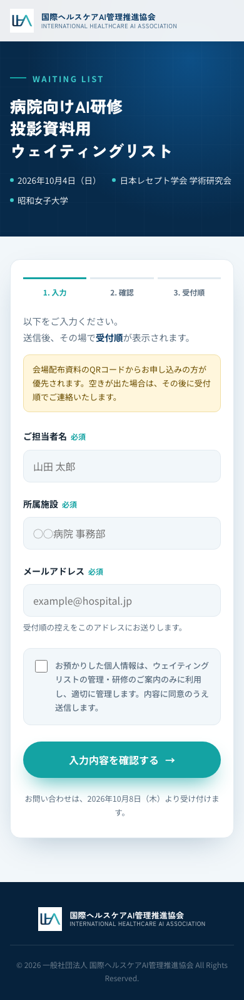 | 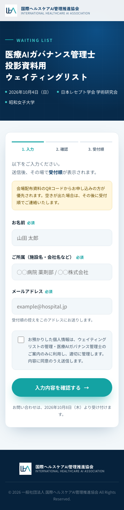 |
| 打ち間違いドメイン | 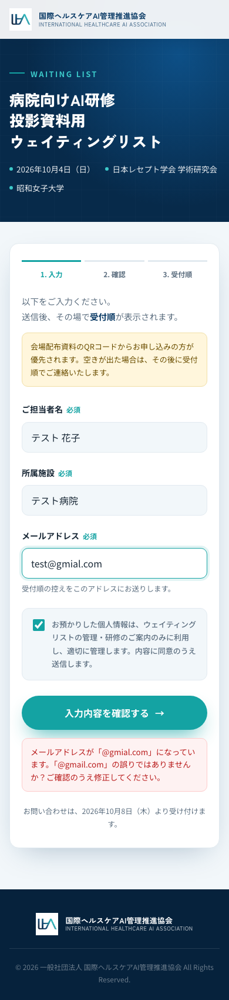 | 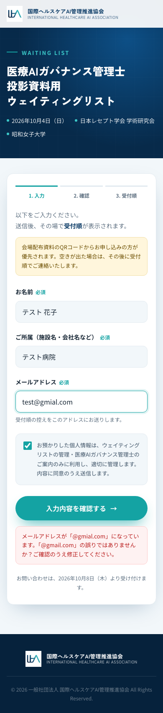 |
| 確認 | 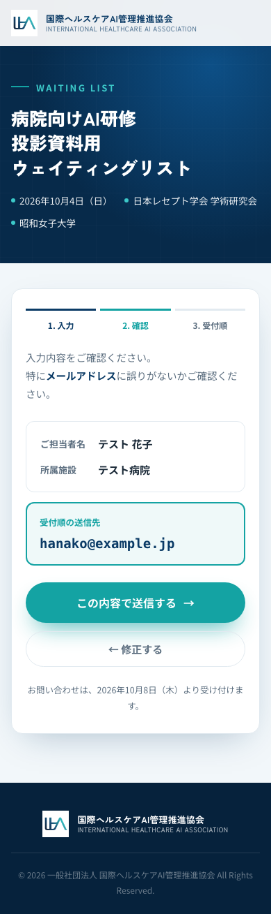 | 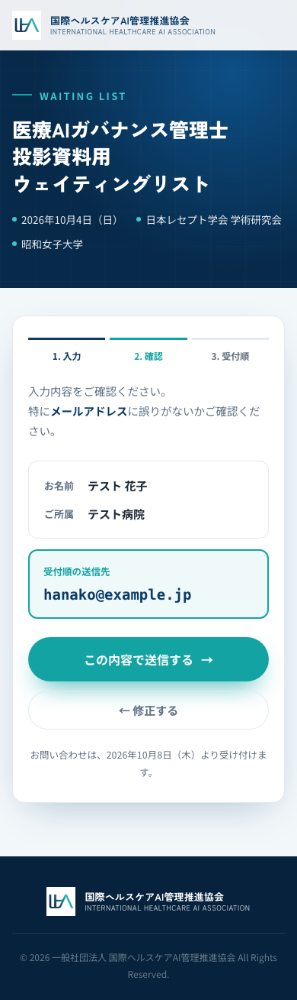 |
| 登録完了 | 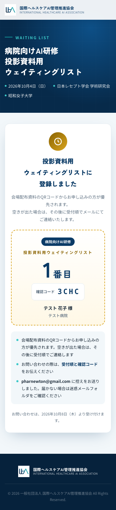 | 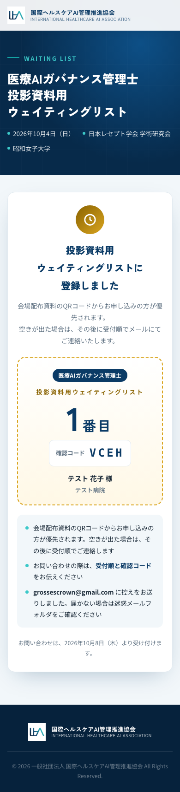 |
| 同じメールで再送信 | 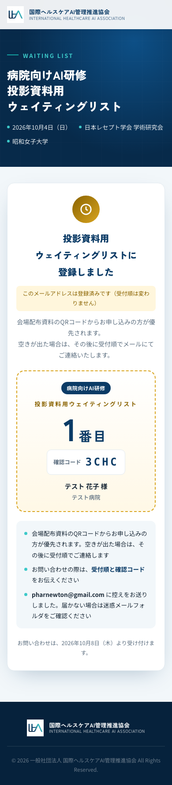 | 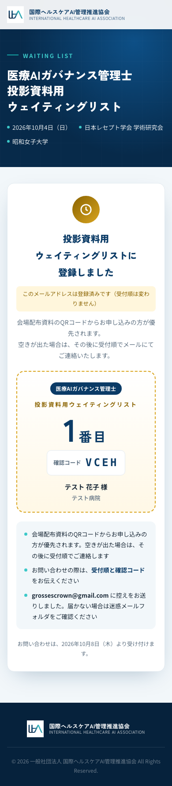 |
| 入力（PC） | 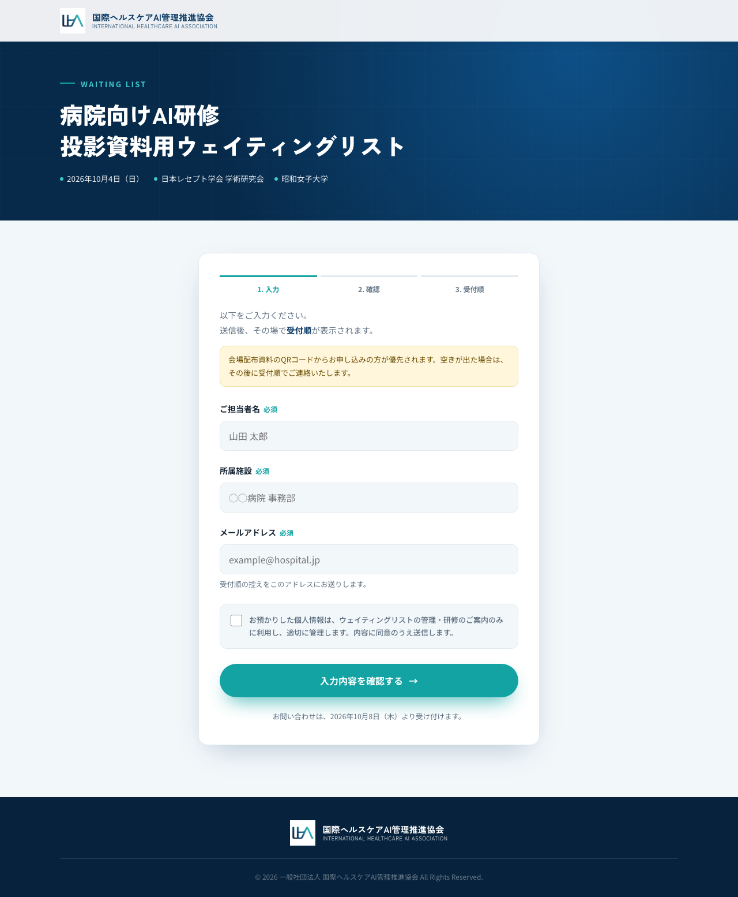 | 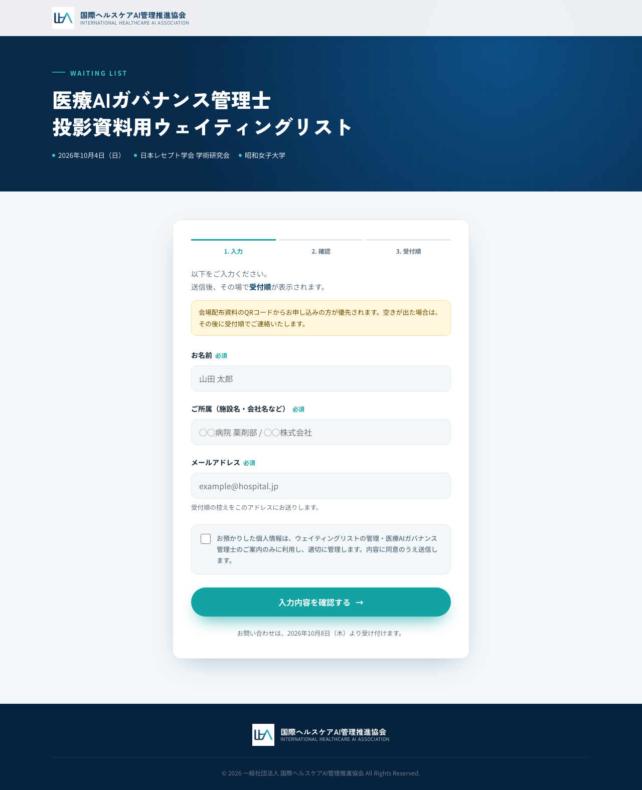 |
| 確認（PC） | 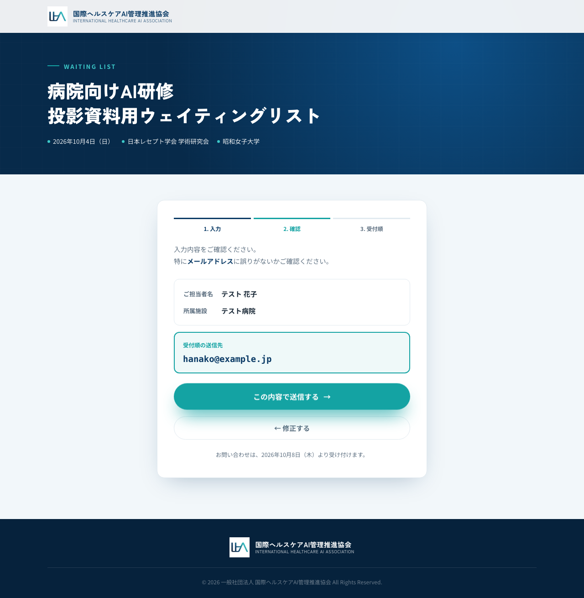 | 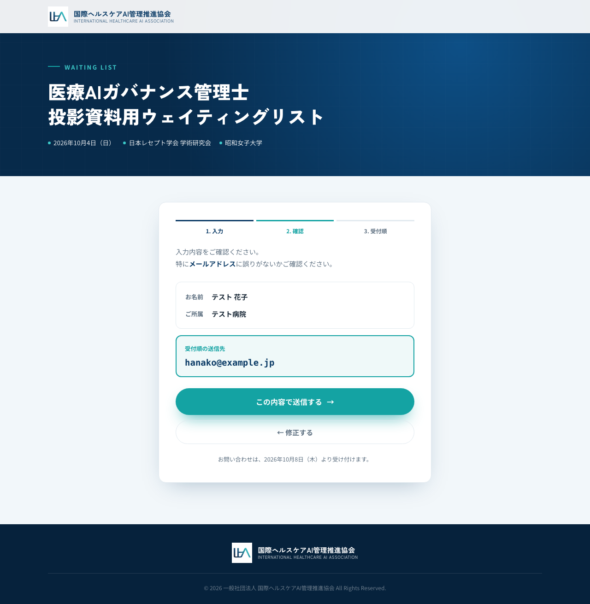 |

### 2. 配布用（`/entry/`・`/kanrishi/`）

`node scripts/entry-prod-shots.js`（送信しない範囲）と
`SUBMIT_EMAIL=grossescrown@gmail.com HOSPITAL_EMAIL=pharnewton@gmail.com node scripts/kanrishi-prod-shots.js`

| 管理士 K-001 / FETD | 管理士 再送信 | 病院向け 001 / N7HQ |
|---|---|---|
| 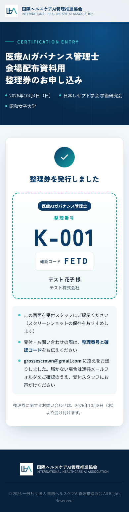 | 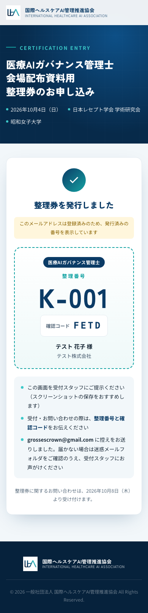 | 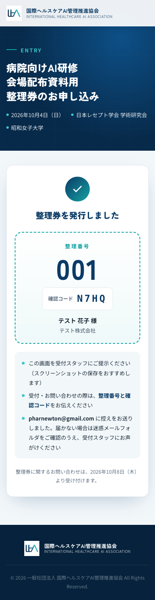 |

入力・エラー・確認画面の撮り直し：`mobile-0*.png`・`desktop-0*.png`（病院向け）、`kanrishi-{mobile,desktop}-0*.png`（管理士）。

### 3. 確認メール

| 宛先 | 件名 |
|---|---|
| pharnewton@gmail.com | 【整理番号 001】病院向けAI研修 会場配布資料用 整理券｜国際ヘルスケアAI管理推進協会 |
| pharnewton@gmail.com | 【投影資料用ウェイティングリスト 1番目】病院向けAI研修｜国際ヘルスケアAI管理推進協会 |
| grossescrown@gmail.com | 【整理番号 K-001】医療AIガバナンス管理士 会場配布資料用 整理券｜国際ヘルスケアAI管理推進協会 |
| grossescrown@gmail.com | 【投影資料用ウェイティングリスト 1番目】医療AIガバナンス管理士｜国際ヘルスケアAI管理推進協会 |

### 4. 後片付け

配布用の整理券タブ（2つ）は 001・K-001 の行の C〜J 列を消去、投影用タブ（2つ）は2行目以降を行削除。Web アプリ URL の応答で配布用 `used:0`／`waiting:0`、投影用 `registered:0` を確認。

## QR コード

`docs/entry-qr/` に4種（レベル H・1200px、読み取り確認済み）。

| ファイル | URL | 用途 |
|---|---|---|
| `entry-qr.png`／`.svg` | `https://www.iha-as.com/entry/` | 配布資料・病院向けAI研修 |
| `kanrishi-qr.png`／`.svg` | `https://www.iha-as.com/kanrishi/` | 配布資料・医療AIガバナンス管理士 |
| `entry-live-qr.png`／`.svg` | `https://www.iha-as.com/entry-live/` | 投影資料・病院向けAI研修 |
| `kanrishi-live-qr.png`／`.svg` | `https://www.iha-as.com/kanrishi-live/` | 投影資料・医療AIガバナンス管理士 |

## 当日までの残作業

- 配布資料・投影スライドに QR を配置（QR の近くに制度名と「会場配布資料用」「投影資料用」を明記）
- 受付スタッフへ連絡順を共有（配布用キャンセル待ち → 投影資料用ウェイティングリスト。投影用は配布用と同じメールがないか確認してから連絡）
- 10/4 開場前に4ページで1件ずつテスト → データ消去 → 受付開始
