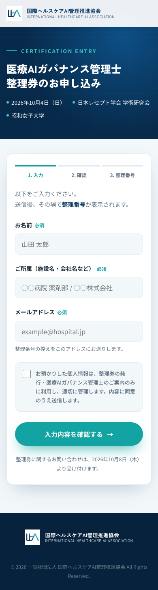
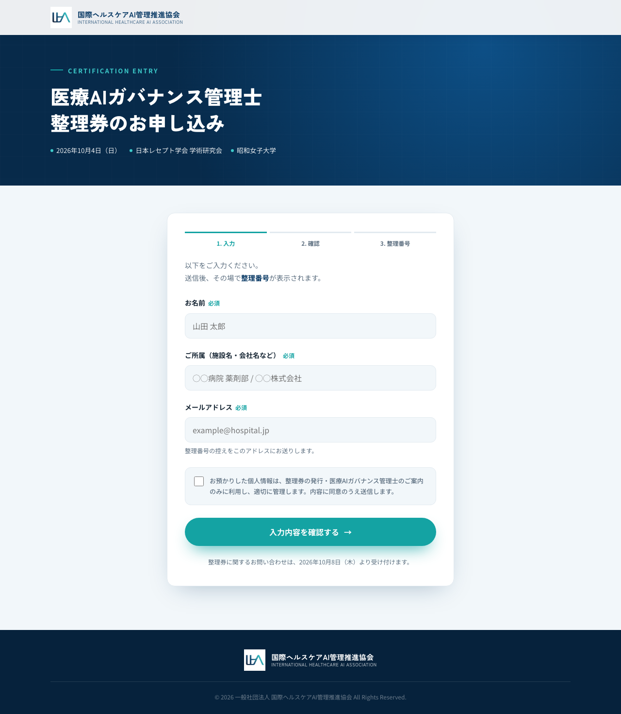
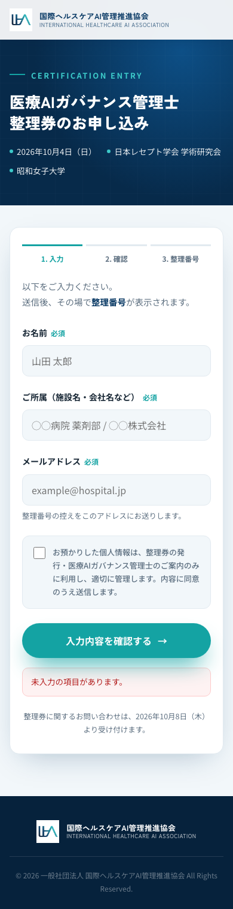
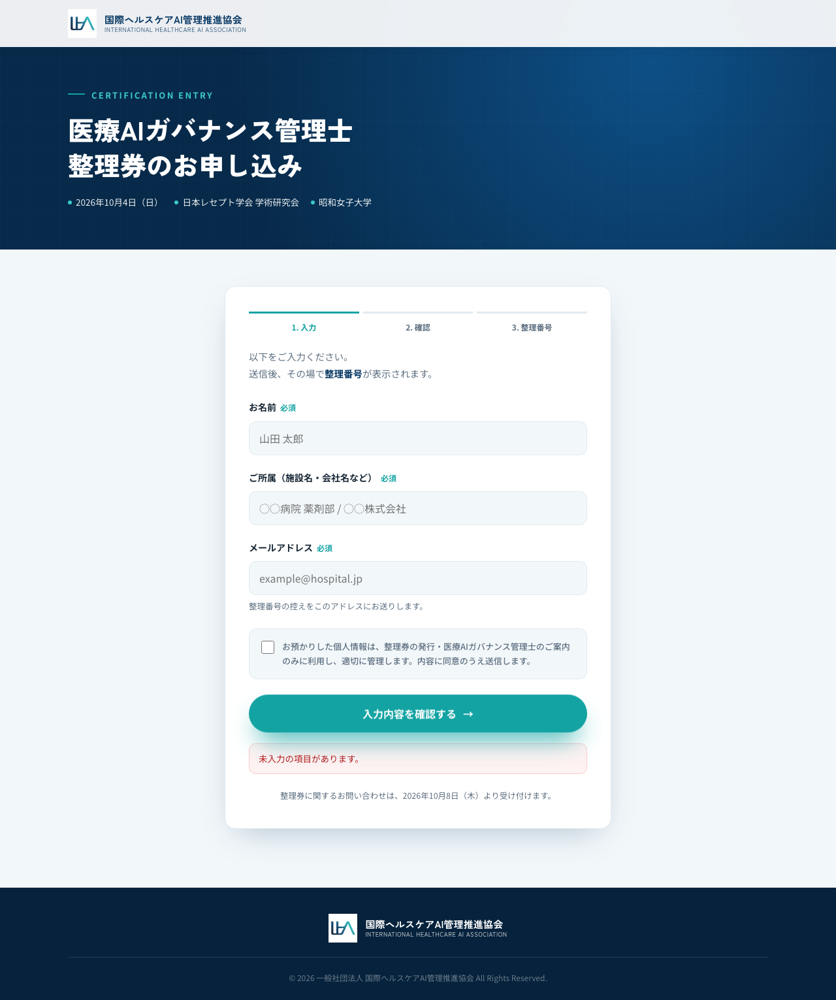
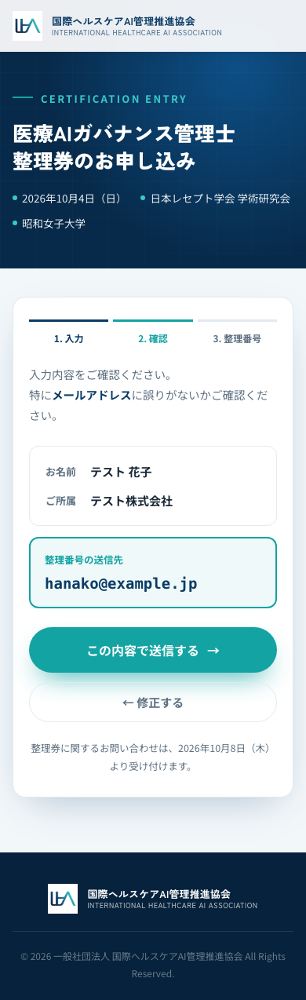
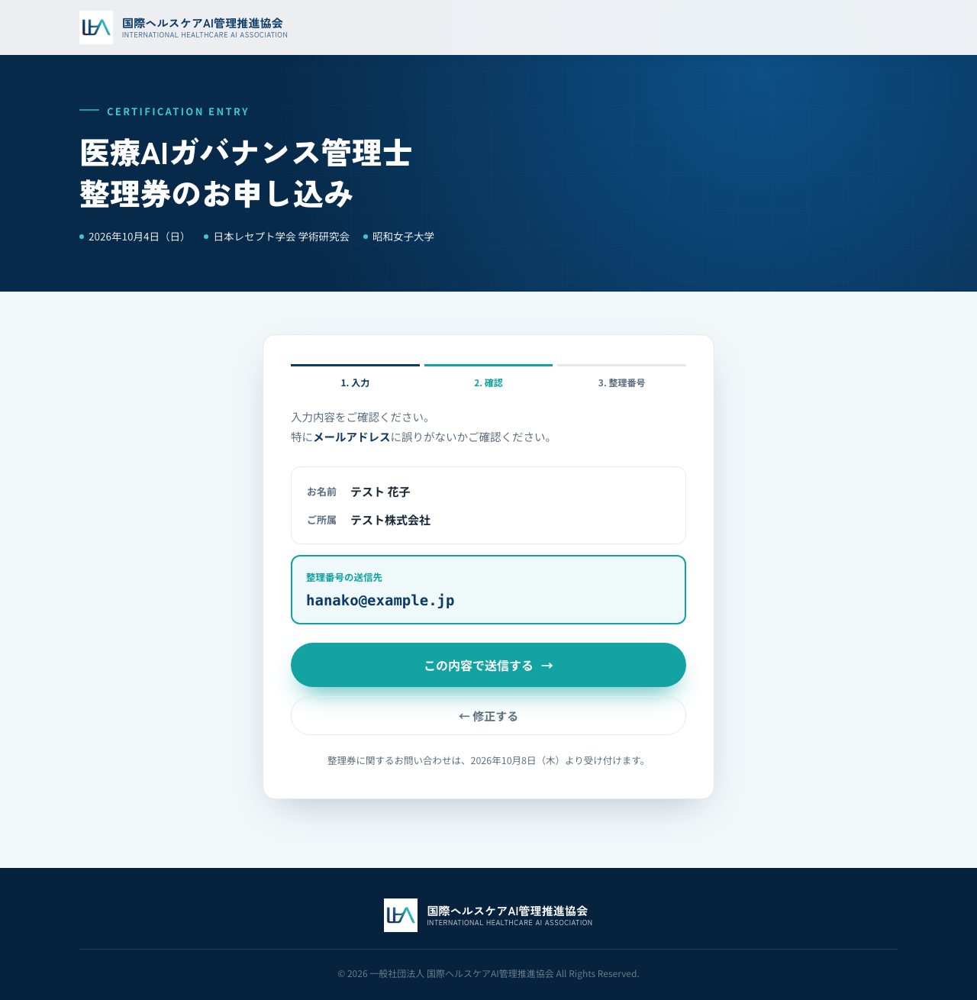
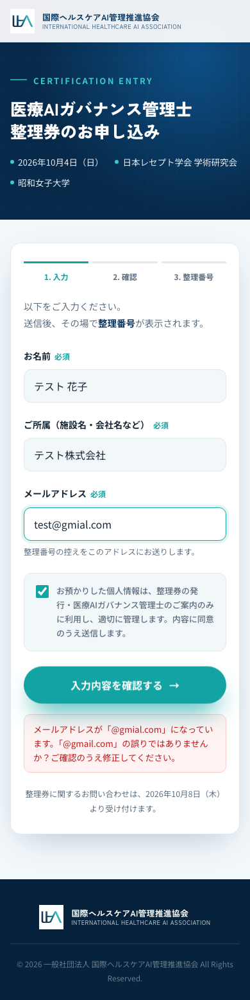
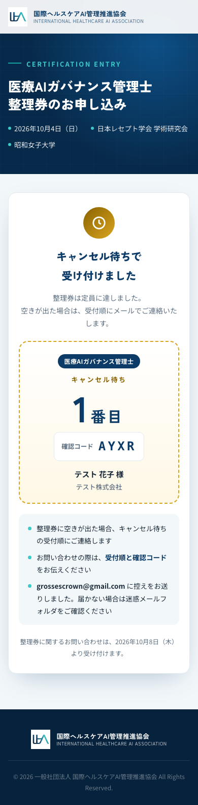
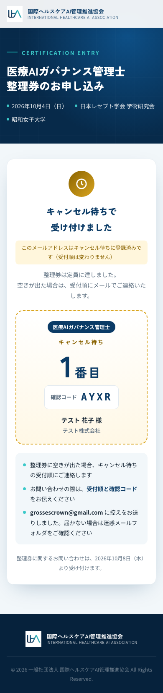

# 医療AIガバナンス管理士 整理券ページ 動作確認レポート

- 実施日：2026-09-30
- 対象：本番 `https://www.iha-as.com/kanrishi/`（main `df0fe4a`）＋ 2制度対応に更新した Apps Script `entry-ticket`（URL は病院向けと共通）
- 方法：Playwright（Chromium）で本番ページを操作・撮影（`scripts/kanrishi-prod-shots.js`）。シート・メールは目視確認
- 条件：Resend 未設定（`"resend":false`）→ 確認メールは Gmail（MailApp）で送信
- 仕様・手順：[`entry-ticket.md`](entry-ticket.md)／病院向けの確認：[`entry-ticket-test-report.md`](entry-ticket-test-report.md)

## 結果サマリー

| # | 受入基準 | 結果 | 備考 |
|---|---|---|---|
| 1 | ロゴ・ヘッダー・フッター・配色が `entry/` と同じ | OK | |
| 2 | スマホ幅（390px／360px）で横スクロールが出ない | OK | 1280px でも出ない |
| 3 | 入力欄が「お名前」「ご所属（施設名・会社名など）」「メールアドレス」 | OK | |
| 4 | 未入力・形式不正（`=x@example.jp`）・同意なしでエラー、確認画面に進まない | OK | |
| 5 | 確認画面でメールを大きく表示、「修正する」で入力内容を保持 | OK | |
| 6 | 送信 → 制度名タグ＋`K-001`＋確認コード、`1004_管理士_整理券` に記録、確認メール受信 | OK | K-001 / FETD |
| 7 | 同じメールで再送信 → 同じ番号＋「登録済み」、メール再送なし | OK | |
| 8 | `test@gmial.com` → 「@gmail.com の誤りではありませんか？」で入力画面に戻り、メール欄にフォーカス | OK | |
| 9 | 存在しないドメイン → 「ドメイン…が見つかりません」 | OK | `test@no-such-domain-iha-as.com` |
| 10 | 定員到達 → 「キャンセル待ち 1番目」＋制度名タグ、`1004_管理士_キャンセル待ち` に記録 | OK | 1番目 / AYXR |
| 11 | 回帰：`/entry/` で送信 → `001` 系の番号、`1004_整理券` に記録（管理士タブに入らない） | OK | 001 |
| 12 | テストデータ消去（4タブ）→ 両制度 `used:0`／`waiting:0` | OK | |

Apps Script は本番反映版（`google-apps-script/entry-ticket.gs`）を、Node 上の Apps Script モックでも確認（既存タブ非変更・K-001〜K-050 作成・打ち間違いドメイン・制度別受付停止・`doGet` の `programs` など 20 項目）。

## テスト手順と結果

### 0. Apps Script 更新の確認

Web アプリ URL の応答に `programs` が追加され、`kanrishi.total: 50` であることを確認してから main にマージ。

### 1. 送信しない範囲

| 画面 | スマホ（390px） | PC（1280px） |
|---|---|---|
| 入力 |  |  |
| 未入力エラー |  |  |
| 確認 |  |  |

| 形式エラー（`=x@example.jp`） | 打ち間違いドメイン（`test@gmial.com`） |
|---|---|
|  |  |

### 2. 整理券の発行

`SUBMIT_EMAIL=pharnewton@gmail.com HOSPITAL_EMAIL=grossescrown@gmail.com node scripts/kanrishi-prod-shots.js`

| 新規発行（K-001 / FETD） | 同じメールで再送信 |
|---|---|
|  |  |

### 3. 回帰確認（病院向け `/entry/`）

同じ実行で `/entry/` から1件送信 → `001` を発行。Web アプリの件数は病院向け `used:1`、管理士 `used:1` と制度別に集計。

### 4. キャンセル待ち

`1004_管理士_整理券` の K-002〜K-050 の「状態」に一時的に「発行済」を入力（`kanrishi.used:50`）。`WAIT_EMAIL=grossescrown@gmail.com node scripts/kanrishi-prod-shots.js`

| 新規（1番目 / AYXR） | 同じメールで再送信 |
|---|---|
|  |  |

Web アプリの件数は管理士 `waiting:1`、病院向け `waiting:0`（病院向けのキャンセル待ちタブには入らない）。

### 5. 後片付け

手順書 E-9 に沿って4タブを消去。Web アプリ URL の応答で両制度とも `used:0`／`waiting:0` を確認。

## 補足

- `grossescrown@gmail.com` は病院向け（001）と管理士（キャンセル待ち）の両方に申し込んだ状態になったが、制度ごとに別々に処理された（同じ人が両制度に申し込める仕様どおり）
- 病院向けの確認コードは `setupTickets` で事前作成したものを使うため、前回テスト（2026-09-30 午後）と同じ `N7HQ` が表示された

## 当日までの残作業

- QR コード2種の作成・印刷（`/entry/`・`/kanrishi/`、パネル・QR に制度名を明記）
- 受付スタッフへ照合方法を共有（`K-` 付き＝管理士、数字のみ＝病院向け）
- 10/4 開場前に両ページで1件ずつテスト → データ消去 → 受付開始
